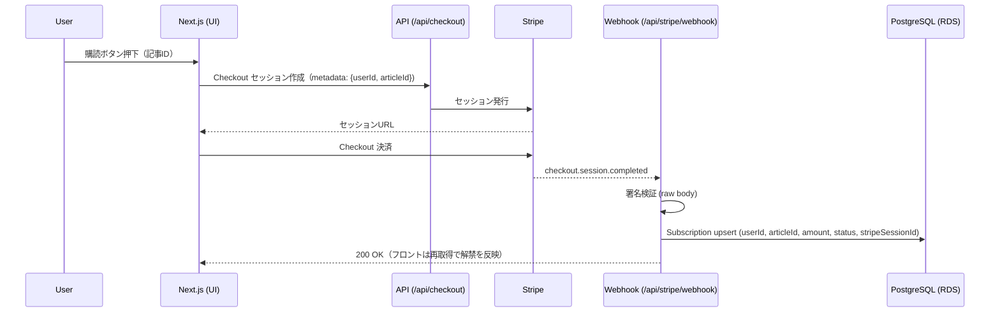

# Architecture

## システム構成図

```mermaid
flowchart LR
  subgraph Client[Browser]
    UI[Next.js UI]
  end

  subgraph App[Next.js App (App Router)]
    API[/Route Handlers/]
    PRISMA[Prisma]
  end

  DB[(PostgreSQL / AWS RDS)]
  STRIPE[Stripe Checkout]
  WEBHOOK[/Stripe Webhook/]

  UI --> API
  API --> PRISMA --> DB
  UI --> STRIPE
  STRIPE --> WEBHOOK --> API
```

## Webhook シーケンス（Checkout → DB 反映）


